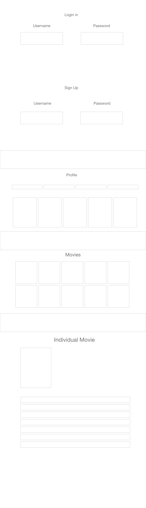

# virtualtheater

## Target

People looking for movies to watch

## Purpose

To help people find movies they can purchase online

## Tech

### API

The movie database
https://developers.themoviedb.org/4/getting-started

### Frontend

Netlify for deployment
React,SCSS, and JSX 

### Backend

Heroku for deployment
Spring Boot with Hibernate
Postgresql for the database

## Deployed App

[Here is a link to the deployed application](https://virtualtheater.netlify.app/ "Here!")

## Wireframe

